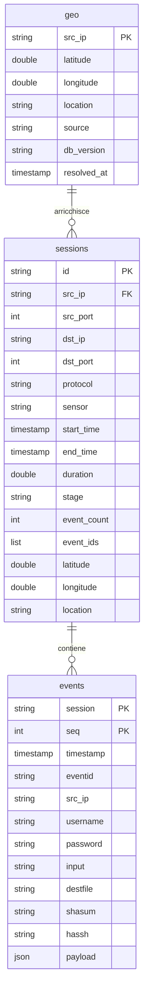

# Progettazione dello Schema dei Dati: Dal Log Grezzo (`cowrie_all`) all'Architettura Analitica DuckDB

> **Documento di Architettura dei Dati e Capitolato di Tesi**  
> Progetto: TimeMap + Cowrie Honeypot  
> Dataset analizzato: `cowrie_all.large.json` (2,37 GB, export completo nativo)  
> Percorso file su disco: [`docs/schema.md`](file:///c:/Users/ludov/Desktop/TimeMap/timemap_v1/docs/schema.md)

---

## 1. Il Metodo: Progettare partendo dalle Domande, non dai Dati

La modellazione di un database per la visualizzazione interattiva di grandi volumi di dati non può limitarsi alla trasposizione diretta delle chiavi JSON in colonne relazionali. Tale approccio produce schemi con decine di campi scarsamente popolati e impone operazioni di aggregazione dinamica che degradano la reattività dell'interfaccia a ogni interazione utente.

La metodologia adottata procede in senso inverso: **individuare formalmente le interrogazioni necessarie all'interfaccia grafica di TimeMap** e strutturare il modello di persistenza affinché tali interrogazioni possano essere risolte con la minima complessità computazionale e I/O.

Dall'analisi dei componenti applicativi (mappa geografica Leaflet, timeline temporale D3 e pannello di controllo filtri) emergono **cinque domande analitiche fondamentali**:

| ID | Descrizione dell'interrogazione | Componente UI | Obiettivo Prestazionale |
| :--- | :--- | :--- | :--- |
| **Q1** | *"Quali sessioni ricadono nell'intervallo temporale $[T_{start}, T_{end}]$, con relative coordinate, stadio di avanzamento (`stage`) ed identificativi di evento?"* | Mappa Leaflet e Timeline D3 (ad ogni operazione di pan e zoom) | **Bassa latenza (target: < 50 ms)** |
| **Q2** | *"Quante sessioni totali e quante sessioni per ciascuno `stage` ricadono nell'intervallo selezionato?"* | Header riepilogativo e metriche di stato | **Aggregazione immediata (target: < 15 ms)** |
| **Q3** | *"Qual è la sequenza cronologica completa dei record grezzi associati alla sessione con identificativo $S_{id}$?"* | Scheda di dettaglio `SessionCard` (eseguita **esclusivamente su richiesta al clic** del marker) | **Asimmetrica / On-Demand (target: < 300 ms)** |
| **Q4** | *"Quali sessioni contengono lo specifico identificativo di evento $E_{id}$?"* | Albero dei filtri nel pannello laterale | **Bassa latenza (target: < 50 ms)** |
| **Q5** | *"Quali sessioni presentano corrispondenze con una specifica sottostringa $Q$ all'interno dei comandi eseguiti, delle credenziali o dei file scaricati?"* | Barra di ricerca full-text | **Scansione selettiva (target: < 100 ms)** |

### Asimmetria prestazionale dei requisiti
L'architettura del sistema è governata da una netta asimmetria nei tempi di risposta richiesti:
* **Q1 e Q2** devono mantenere una frequenza di aggiornamento elevata per garantire la continuità visiva durante il trascinamento dello slider temporale o l'esplorazione cartografica. La query corrispondente deve operare su un volume ridotto di tuple già indicizzate o raggruppate.
* **Q3** non vincola la reattività generale del sistema: l'utente richiede il dettaglio di una sessione in modo puntuale. L'elaborazione del log grezzo può pertanto essere differita e demandata a una seconda query mirata (*detail-on-demand*).

---

## 2. Il Contratto dell'Interfaccia e la Gestione dei Dettagli

Nel sistema originale, la funzione `sessionToEvent` definita in [`src/common/cowrie.js`](file:///c:/Users/ludov/Desktop/TimeMap/timemap_v1/src/common/cowrie.js) rappresentava il punto di raccordo tra i dati grezzi e l'architettura Redux di TimeMap:

```javascript
{
  id: session.id,
  civId: session.id,
  description: `${session.id} ${session.srcIp}:${session.srcPort} > ${session.dstIp}:${session.dstPort} ${session.protocol}`,
  date: "MM/DD/YYYY",
  time: "HH:mm",
  latitude: session.latitude,
  longitude: session.longitude,
  location: session.location,
  category: stage,
  associations: [`stage:${stage}`, ...session.eventIds]
}
```

### Differimento dei log grezzi per `SessionCard`
Nella configurazione statica di prova (`sample_1000.json`), l'intero albero degli eventi associati a ciascuna sessione veniva caricato preventivamente in memoria all'interno della proprietà `event.session.events`.  
Con un archivio analitico di oltre 4 milioni di eventi, tale pre-caricamento è impraticabile. L'endpoint principale (relativo a Q1) trasmette esclusivamente i metadati sintetici della sessione; il componente [`SessionCard.jsx`](file:///c:/Users/ludov/Desktop/TimeMap/timemap_v1/src/components/controls/SessionCard.jsx) viene predisposto per effettuare una richiesta asincrona dedicata all'endpoint del log grezzo (`GET /api/sessions/:id/raw`) al momento della selezione del marker.

---

## 3. Analisi Empirica del Dataset Reale: `cowrie_all.large.json`

L'analisi quantitativa condotta sul file `cowrie_all.large.json` (2,37 GB) evidenzia la struttura reale dell'archivio dell'honeypot:

* **Eventi grezzi totali:** 4.224.569 record atomici.
* **Sessioni complessive:** circa 320.000 sessioni distinte identificate dalla chiave `session`.
* **Campi censiti:** 42 chiavi eterogenee distribuite in modo disomogeneo tra le diverse tipologie di evento.
* **Analisi del campo `shasum` (313.769 occorrenze totali):**
  * **262.981 record (83,8%)** corrispondono all'hash SHA-256 della registrazione della sessione interattiva del terminale (`ttylog`), generata all'evento `cowrie.log.closed`.
  * **50.788 record (16,2%)** corrispondono all'impronta crittografica di file effettivamente trasferiti (`cowrie.session.file_download` e `file_upload`).
* **Analisi dei download (47.622 eventi `cowrie.session.file_download`):**
  * Il campo `url` compare in soli **281 eventi (0,59%)**, in quanto la maggioranza dei tentativi di download automatizzati avviene tramite percorsi diretti o injection via shell.
  * Il campo `destfile` (il nome del file registrato sul disco locale) compare in **47.341 eventi (99,41%)**.
  * Ne consegue che la colonna promossa per l'identificazione e la ricerca di artefatti scaricati deve essere `destfile`, affiancata da `shasum`.
* **Disomogeneità dei tipi:** Il campo `duration` è rappresentato talvolta come stringa (es. `"0.0"`), talvolta come valore numerico a virgola mobile. La fase di caricamento normalizza tale attributo nel tipo `DOUBLE`.

---

## 4. Il Modello a Tre Tabelle per DuckDB

L'architettura dei dati adotta il motore colonnare vettorializzato **DuckDB**, strutturando le entità in **tre tabelle specializzate**:



### Specifiche DDL e Ottimizzazione DuckDB

```sql
-- 1. Tabella Geolocalizzazione (Arricchimento IP, 601 indirizzi unici)
CREATE TABLE geo (
    src_ip VARCHAR PRIMARY KEY,
    latitude DOUBLE,
    longitude DOUBLE,
    location VARCHAR,
    source VARCHAR DEFAULT 'MaxMind GeoLite2',
    db_version VARCHAR,
    resolved_at TIMESTAMP DEFAULT CURRENT_TIMESTAMP
);

-- 2. Tabella Sessioni (Materializzata per rispondere a Q1, Q2, Q4)
-- NOTA TECNICA SULL'ORDINAMENTO (Sort-on-Insert):
-- DuckDB non impiega indici B-Tree per filtri ad intervallo, bensì zonemap
-- (statistiche min/max memorizzate per ciascun blocco di tuple).
-- L'ordinamento esplicito su start_time garantisce l'efficacia del block skipping.
CREATE TABLE sessions (
    id VARCHAR PRIMARY KEY,
    src_ip VARCHAR,
    src_port INTEGER,
    dst_ip VARCHAR,
    dst_port INTEGER,
    protocol VARCHAR,
    sensor VARCHAR,
    start_time TIMESTAMP,
    end_time TIMESTAMP,
    duration DOUBLE,
    stage VARCHAR,
    event_count INTEGER,
    event_ids VARCHAR[],
    latitude DOUBLE,
    longitude DOUBLE,
    location VARCHAR
);

-- 3. Tabella Eventi Grezzi (Formato atomico originale da cowrie_all)
-- La chiave composita (session, seq) evita collisioni con il campo 'id' nativo di Cowrie.
CREATE TABLE events (
    session VARCHAR,
    seq INTEGER,
    timestamp TIMESTAMP,
    eventid VARCHAR,
    src_ip VARCHAR,
    username VARCHAR,
    password VARCHAR,
    input VARCHAR,
    destfile VARCHAR,
    shasum VARCHAR,
    hassh VARCHAR,
    payload JSON,
    PRIMARY KEY (session, seq)
);
```

---

## 5. Decisioni Architetturali e Analisi delle Alternative

### Decisione 1: Pre-calcolo dello `stage` nella tabella `sessions`
* **Scelta:** Pre-calcolo deterministico dello `stage` in fase di materializzazione della tabella `sessions`.
* **Motivazione:** Lo `stage` sintetizza la gravità massima raggiunta dall'attaccante all'interno della sessione (secondo la gerarchia stabilita in `SESSION_STAGES`: `file_download` > `direct-tcpip` > `command.input` > `login.success` > `login.failed` > `session.connect`). Ricalcolare tale valore dinamicamente tramite `GROUP BY` e valutazioni condizionali sui 4,22 milioni di eventi grezzi ad ogni operazione di zoom o scorrimento temporale comporterebbe un sovraccarico computazionale continuo. La persistenza del dato calcolato nella riga di sessione assicura la risoluzione delle query di disegno tramite la lettura sequenziale di una sola colonna.
* **Alternative scartate:**
  1. *Aggregazione on-the-fly con JOIN e CASE ad ogni richiesta:* Scartata poiché comporta la scansione di milioni di record grezzi ad ogni aggiornamento della timeline.
  2. *View SQL non materializzata:* Scartata in quanto, non preservando uno stato intermedio, ri-esegue la logica di raggruppamento ad ogni accesso.

---

### Decisione 2: Gestione dei campi variabili: Modello Ibrido (Colonne + JSON)
* **Scelta:** Promozione a colonna tipizzata dei soli attributi soggetti a interrogazione frequente (`username`, `password`, `input`, `destfile`, `shasum`, `hassh`). Conservazione di tutti i rimanenti attributi (oltre 30 chiavi accessorie, quali `kexAlgs`, `macCS`, `ttylog`, `message`) all'interno della colonna semi-strutturata `payload JSON`.
* **Motivazione:** Le colonne promosse soddisfano specificamente le esigenze di filtro e ricerca testuale di Q4 e Q5. La memorizzazione in formato colonnare nativo consente a DuckDB di eseguire scansioni vettorizzate SIMD escludendo le colonne non coinvolte. Il mantenimento del JSON grezzo preserva l'integrità del log originale per la renderizzazione della `SessionCard`.
* **Alternative scartate:**
  1. *Memorizzazione integrale in un singolo campo JSON:* Scartata poiché la ricerca testuale su comandi o credenziali richiederebbe il parsing e l'estrazione JSON riga per riga su 4,22 milioni di tuple.
  2. *Schema relazionale completamente espanso (42 colonne):* Scartata a causa dell'estrema sparsità dei dati (la quasi totalità delle chiavi esiste per meno del 2% degli eventi), con conseguente frammentazione dei metadati dello storage.

---

### Decisione 3: Tracciamento degli eventid tramite colonna array `event_ids`
* **Scelta:** Memorizzazione della lista dei codici evento distinti nella colonna `event_ids VARCHAR[]` all'interno della tabella `sessions`.
* **Motivazione:** L'interrogazione Q4 richiede di individuare le sessioni che includono un determinato evento (es. `cowrie.command.input`). L'adozione di un array nativo consente a DuckDB di applicare la funzione di appartenenza `list_contains(event_ids, '...')` operando esclusivamente sulla tabella `sessions`. La query evita il ricorso a operazioni di join con la tabella `events`.
* **Alternative scartate:**
  1. *Tabella ponte relazionale normalizzata `session_eventids (session, eventid)`:* Scartata per via dell'overhead generato dalla moltiplicazione delle tuple e per la necessità di introdurre una `JOIN` per recuperare i parametri di sessione.
  2. *Subquery dinamica con `IN (SELECT session FROM events WHERE eventid = ...)`:* Scartata per il costo computazionale associato alla scansione della tabella di dettaglio.

---

### Decisione 4: Visualizzazione Dinamica Multi-Filtro: Il Modello a Spicchi (Pie-Chart Markers)

L'analisi visiva avanzata consente all'utente di superare la rigidità di una classificazione univariata:

1. **Selezione concomitante di un massimo di 6 filtri:**  
   L'analista può selezionare fino a 6 filtri dall'albero degli eventi di Cowrie. Il limite è dimensionato in conformità ai principi di percezione visiva per garantire la discriminabilità di palette cromatiche ad alto contrasto.
2. **Assegnazione dinamica dei colori:**  
   Ciascun filtro attivo riceve una codifica cromatica dedicata.
3. **Scomposizione geometrica a spicchi:**  
   Qualora una sessione contenga eventi afferenti a molteplici filtri selezionati, il marker associato viene suddiviso proporzionalmente in settori circolari uguali:
   * 1 filtro corrispondente: arco continuo a 360°.
   * 2 filtri corrispondenti: 2 semicerchi da 180°.
   * 3 filtri corrispondenti: 3 settori da 120°.
   * Fino a 6 settori da 60°.
4. **Implementazione nel frontend:**  
   La renderizzazione geometrica si appoggia al componente SVG [`ColoredMarkers.jsx`](file:///c:/Users/ludov/Desktop/TimeMap/timemap_v1/src/components/atoms/ColoredMarkers.jsx) e alla funzione `zipColorsToPercentages` in [`src/common/utilities.js`](file:///c:/Users/ludov/Desktop/TimeMap/timemap_v1/src/common/utilities.js).
5. **Efficienza computazionale:**  
   Il backend non effettua calcoli geometrici. Restituendo l'array `event_ids`, il client calcola l'intersezione con i filtri attivi localmente in $O(1)$, preservando il rendering a 60 FPS.

---

## 6. Bozza dei Quattro Endpoint REST del Server

### 1. `GET /api/sessions` (Alimenta Mappa e Timeline - Q1, Q4, Q5)
Restituisce l'elenco delle sessioni comprese nell'intervallo temporale, con supporto a filtri per stadio, codice evento e ricerca testuale.
* **Parametri di richiesta:** `from` (ISO timestamp), `to` (ISO timestamp), `stage` (opzionale), `eventid` (opzionale), `q` (opzionale, stringa di ricerca).
* **Query SQL eseguita internamente:**
  ```sql
  SELECT id, src_ip, src_port, dst_ip, dst_port, protocol, sensor,
         start_time, end_time, duration, stage, event_count, event_ids,
         latitude, longitude, location
  FROM sessions
  WHERE start_time >= :from AND start_time <= :to
    AND (:stage IS NULL OR stage = :stage)
    AND (:eventid IS NULL OR list_contains(event_ids, :eventid))
    AND (:q IS NULL OR id IN (
        SELECT DISTINCT session FROM events 
        WHERE input ILIKE '%' || :q || '%' 
           OR username ILIKE '%' || :q || '%' 
           OR destfile ILIKE '%' || :q || '%'
    ))
  ORDER BY start_time ASC;
  ```

### 2. `GET /api/sessions/count` (Alimenta l'Header delle Metriche - Q2)
Restituisce il conteggio complessivo delle sessioni e la ripartizione per stage nell'intervallo specificato.
* **Parametri di richiesta:** `from`, `to`.
* **Query SQL eseguita internamente:**
  ```sql
  SELECT 
      COALESCE(stage, '__TOTAL__') AS stage,
      count(*) AS count
  FROM sessions
  WHERE start_time >= :from AND start_time <= :to
  GROUP BY ROLLUP(stage);
  ```

### 3. `GET /api/sessions/:id/raw` (Alimenta la `SessionCard` al clic - Q3)
Restituisce la sequenza ordinata degli eventi grezzi relativi a una singola sessione.
* **Query SQL eseguita internamente:**
  ```sql
  SELECT session, seq, timestamp, eventid, src_ip, username, password, input, destfile, shasum, payload
  FROM events
  WHERE session = :id
  ORDER BY seq ASC;
  ```

### 4. `GET /api/filters/eventids` (Alimenta l'albero dei filtri laterale)
Restituisce i codici evento rilevati nel dataset con il numero di sessioni in cui compaiono.
* **Query SQL eseguita internamente:**
  ```sql
  SELECT unnest(event_ids) AS eventid, count(DISTINCT id) AS session_count
  FROM sessions
  GROUP BY eventid
  ORDER BY session_count DESC;
  ```

---

## 7. Criterio di Validazione dello Schema

> **Verifica di coerenza architetturale:**  
> *«Per visualizzare la timeline su un intervallo di due mesi, quante tabelle interroga la query e quante righe legge?»*

* **Esito:**  
  La query interroga **una sola tabella (`sessions`)** e legge **una riga per sessione** (circa 320.000 tuple nell'intero dataset, filtrate istantaneamente mediante zonemap ordinate su `start_time`).  
  La tabella di dettaglio `events` (4.224.569 tuple) non viene acceduta durante la renderizzazione ordinaria, garantendo il rispetto dei vincoli di reattività del frontend.
