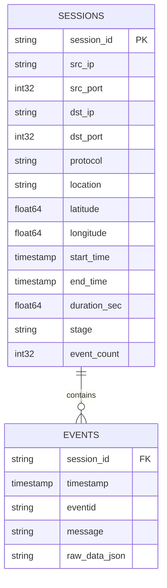

# Pipeline Cowrie → Parquet: Guida Architetturale e Benchmark (Modulo 4)

Questa guida illustra nel dettaglio l'architettura, la logica di business e i passi operativi per realizzare la pipeline di trasformazione **ETL (Extract - Transform - Load)** dai log grezzi Cowrie in formato **JSON** al formato binario e colonnare **Apache Parquet**, implementando la logica di classificazione `deriveStage` in Python e misurando le performance.

---

## 1. Il Contesto e il Senso del "Modulo 4"

Nel progetto TimeMap fino a questo momento, l'applicazione caricava nel browser file JSON testuali (come [sample_1000.json](file:///c:/Users/ludov/Desktop/TimeMap/timemap_v1/public/sample_1000.json) da circa 4 MB, o tentava di gestire il dataset completo [cowrie_by_session.large.json](file:///c:/Users/ludov/Desktop/TimeMap/data/cowrie_by_session.large.json) da **2,56 GB**).

### Il Problema dei Dati Grezzi in JSON

Dal punto di vista dell'ingegneria del software e dei sistemi (pensando a come la memoria è gestita in **C** o in **Java**):

1. **Ridondanza testuale estrema**: In un file JSON, ogni singolo record ripete i nomi dei campi come stringhe ASCII (`"eventid"`, `"timestamp"`, `"src_ip"`, `"src_port"`). Su 600.000 sessioni e milioni di eventi, centinaia di megabyte sono sprecati solo per ripetere le chiavi.
2. **Costo di Parsing $O(N)$**: Per leggere un JSON, il computer deve scorrere ogni singolo byte, interpretare parentesi graffe, fare escape delle stringhe e convertire testo in numeri (es. la funzione `atoi()` o `Double.parseDouble()`). Caricare 2,5 GB di JSON richiede decine di secondi e alloca in RAM dai 6 agli 8 GB di oggetti. Nessun browser o processo leggero può farlo.
3. **Mancanza di indicizzazione e tipi**: Tutto è testo non tipizzato.

### Perché Parquet (Il salto di paradigma)

**Apache Parquet** è uno standard industriale open source per l'archiviazione colonnare (*Columnar Storage*).

Per capire la differenza rispetto a un JSON (orientato alle righe), usiamo un'analogia classica del C:

* **JSON (Row-oriented / Array of Structs - AoS)**:
  In memoria o su disco i dati sono salvati come un array continuo di record interi:
  `[Record 1: ip, date, stage], [Record 2: ip, date, stage], [Record 3: ip, date, stage]...`
  Se vuoi contare quante sessioni sono allo stage `cowrie.login.failed`, devi caricare e scorrere **l'intero file**, saltando i byte non necessari.
* **Parquet (Column-oriented / Struct of Arrays - SoA)**:
  I dati sono memorizzati **colonna per colonna**:
  - Blocco 1: tutti gli `ip` contigui
  - Blocco 2: tutte le `date` contigue
  - Blocco 3: tutti gli `stage` contigui

```
Format JSON (Row-based):
┌────────────────────────────────────────────────────────┐
│ session_1: { ip: "1.1.1.1", port: 22, stage: "login" } │
│ session_2: { ip: "2.2.2.2", port: 22, stage: "shell" } │
│ session_3: { ip: "3.3.3.3", port: 22, stage: "login" } │
└────────────────────────────────────────────────────────┘

Format Parquet (Column-based):
┌────────────────────────────────────────────────────────┐
│ Colonna IP:    ["1.1.1.1", "2.2.2.2", "3.3.3.3"]       │
│ Colonna Port:  [22, 22, 22]  <-- Compressione enorme!   │
│ Colonna Stage: ["login", "shell", "login"]             │
└────────────────────────────────────────────────────────┘
```

> [!NOTE]
> **I due enormi vantaggi di Parquet per la tesi:**
> 1. **Compressione elevatissima**: Poiché valori simili o identici dello stesso tipo sono memorizzati uno accanto all'altro, algoritmi come **Snappy** o **ZSTD** e il *Dictionary Encoding* (es. salvare 22 ripetuto come un contatore invece che 4 byte ogni volta) riducono il file tipicamente del **70% - 90%** rispetto al JSON.
> 2. **Proiezione delle colonne (*Column Projection*)**: Se uno script o una query SQL (es. con DuckDB) deve calcolare statistiche solo sulla colonna `stage` e `duration`, Parquet legge dal disco solo i byte di quelle due colonne, ignorando completamente il resto.

---

## 2. La Logica di `deriveStage`: Da JavaScript a Python

Nel frontend ([cowrie.js](file:///c:/Users/ludov/Desktop/TimeMap/timemap_v1/src/common/cowrie.js)), la funzione `deriveStage` calcola per ogni sessione di attacco **l'avanzamento massimo dell'attaccante** (cioè quale punto della Kill Chain ha raggiunto).

### 2.1 La Logica Originale (JavaScript)

In JavaScript il codice era:

```javascript
export const SESSION_STAGES = [
  {
    id: "cowrie.session.file_download",
    test: (ids) =>
      ids.has("cowrie.session.file_download") ||
      ids.has("cowrie.session.file_download.failed") ||
      ids.has("cowrie.session.file_upload"),
  },
  {
    id: "cowrie.direct-tcpip.request",
    test: (ids) => some(ids, (id) => id.startsWith("cowrie.direct-tcpip.")),
  },
  {
    id: "cowrie.command.input",
    test: (ids) => some(ids, (id) => id.startsWith("cowrie.command.")),
  },
  {
    id: "cowrie.login.success",
    test: (ids) => ids.has("cowrie.login.success"),
  },
  {
    id: "cowrie.login.failed",
    test: (ids) => ids.has("cowrie.login.failed"),
  },
  {
    id: "cowrie.session.connect",
    test: () => true, // fallback se non c'è altro
  },
];

export function deriveStage(eventIds) {
  const ids = eventIds instanceof Set ? eventIds : new Set(eventIds);
  return SESSION_STAGES.find((s) => s.test(ids)).id;
}
```

### 2.2 Il Significato Semantico (La Kill Chain Cowrie)

La funzione valuta le condizioni in ordine di gravità decrescente:
1. **Trasferimento file** (`file_download` / `file_upload`): l'attaccante ha scaricato malware o esfiltrato dati.
2. **Tunneling di rete** (`direct-tcpip.*`): l'attaccante usa l'honeypot come proxy o tunnel verso altre reti.
3. **Esecuzione comandi** (`command.*`): l'attaccante ha aperto una shell interattiva e digitato comandi (`cd`, `ls`, `curl`, `chattr`).
4. **Accesso riuscito** (`login.success`): ha indovinato username e password.
5. **Accesso fallito** (`login.failed`): ha tentato il bruteforce ma non è entrato.
6. **Connessione TCP/SSH** (`session.connect`): si è solo connesso (o scanner di rete).

### 2.3 La Traduzione in Python

In Python (pensando all'equivalente di un `HashSet<String>` in Java o a una tabella hash in C), usiamo un `set` nativo. La verifica di appartenenza `in` è un'operazione istantanea $O(1)$.

```python
def derive_stage(event_ids: set[str]) -> str:
    """
    Determina lo stage massimo raggiunto da una sessione di attacco Cowrie.
    Valuta la gerarchia in ordine di severità decrescente:
    1. Download/Upload file (esfiltrazione / drop malware)
    2. Richieste TCP tunnel / proxy
    3. Comandi shell interattivi
    4. Login riuscito
    5. Tentativo di login fallito
    6. Connessione stabilita (fallback)
    """
    # 1. Trasferimento file
    if (
        "cowrie.session.file_download" in event_ids
        or "cowrie.session.file_download.failed" in event_ids
        or "cowrie.session.file_upload" in event_ids
    ):
        return "cowrie.session.file_download"

    # 2. Tunneling TCP/IP (qualsiasi evento che inizi con 'cowrie.direct-tcpip.')
    if any(eid.startswith("cowrie.direct-tcpip.") for eid in event_ids):
        return "cowrie.direct-tcpip.request"

    # 3. Comandi eseguiti (qualsiasi evento che inizi con 'cowrie.command.')
    if any(eid.startswith("cowrie.command.") for eid in event_ids):
        return "cowrie.command.input"

    # 4. Login con successo
    if "cowrie.login.success" in event_ids:
        return "cowrie.login.success"

    # 5. Login fallito
    if "cowrie.login.failed" in event_ids:
        return "cowrie.login.failed"

    # 6. Fallback: semplice connessione TCP
    return "cowrie.session.connect"
```

> [!TIP]
> Questa funzione è **pura** (non ha effetti collaterali) e opera su un insieme di stringhe. Poiché una sessione Cowrie ha mediamente da 2 a 15 tipi di evento distinti, l'esecuzione di questa funzione impiega meno di **1 microsecondo** per sessione.

---

## 3. Modellazione dei Dati: Come Strutturare il Parquet

In Parquet non si salva un "blocco grezzo non strutturato". Si definisce uno **schema tipizzato**, esattamente come una `struct` in C o una tabella in un database SQL.

Nel file JSON sorgente (`cowrie_by_session`), ogni sessione contiene due livelli:
1. **Dati aggregati di sessione**: IP sorgente, coordinate geografiche, data inizio, durata.
2. **Array di eventi grezzi**: la lista dei singoli eventi di log (`events: [...]`).

Per sfruttare le prestazioni di Parquet, la best practice architetturale (tipica del Modulo 4) consiste nel creare **due file Parquet relazionali**:



1. **`sessions.parquet`**: Una riga per ogni sessione di attacco. È la tabella leggera, perfetta per TimeMap (timeline, mappa mondiale, filtri, grafici).
2. **`events.parquet`**: Una riga per ogni singolo evento di log, collegata alla sessione tramite `session_id` (foreign key). Questa tabella contiene i log completi e viene interrogata solo quando l'utente apre la card di dettaglio di una specifica sessione.

---

## 4. Metriche Chiave da Misurare nel Benchmark

Come richiesto dal modulo 4, dobbiamo misurare con rigore scientifico tre metriche essenziali:

### 1. Dimensioni dei File
* **$D_{\text{JSON}}$**: Dimensione in byte/megabyte del file JSON originale.
* **$D_{\text{Parquet}}$**: Dimensione in byte/megabyte del file Parquet generato (con compressione ZSTD o Snappy).
* **Metriche derivate**:
  $$\text{Compression Ratio} = \frac{D_{\text{JSON}}}{D_{\text{Parquet}}}$$
  $$\text{Space Savings (\%)} = \left( 1 - \frac{D_{\text{Parquet}}}{D_{\text{JSON}}} \right) \times 100$$

### 2. Tempi di Esecuzione (Latency)
Misurati con timer ad alta precisione (`time.perf_counter()` in Python):
* **$T_{\text{read}}$**: Tempo per leggere e deserializzare il JSON da disco.
* **$T_{\text{transform}}$**: Tempo per processare le sessioni, estrarre i campi ed eseguire `derive_stage()`.
* **$T_{\text{write}}$**: Tempo per serializzare i dati nel formato binario colonnare Parquet su disco.
* **$T_{\text{total}}$**: Tempo totale della pipeline ($T_{\text{read}} + T_{\text{transform}} + T_{\text{write}}$).

### 3. Throughput Operativo
* **Throughput in Dati**: $\text{Throughput (MB/s)} = \frac{D_{\text{JSON}} (\text{MB})}{T_{\text{total}} (\text{s})}$
* **Throughput in Record**: $\text{Throughput (Sessioni/s)} = \frac{N_{\text{sessioni}}}{T_{\text{total}} (\text{s})}$

---

## 5. Lo Script di Conversione Completo (`convert_to_parquet.py`)

Questo script in Python fa tutto ciò che è richiesto:
1. Legge il JSON (con supporto per `sample_1000.json` o per il dataset completo da 2.5 GB).
2. Esegue `derive_stage` e la normalizzazione dei tipi (date, float, int).
3. Salva i risultati in Parquet con compressione.
4. Calcola e stampa a terminale il report di benchmark completo.

```python
#!/usr/bin/env python3
"""
Pipeline ETL: Cowrie JSON -> Apache Parquet con calcolo di deriveStage e Benchmark.
Modulo 4 - TimeMap Honeypot Analytics.
"""

import sys
import os
import time
import json
from datetime import datetime
import pyarrow as pa
import pyarrow.parquet as pq

# ----------------------------------------------------------------------
# 1. Logica deriveStage (trasposta da JS a Python)
# ----------------------------------------------------------------------
def derive_stage(event_ids: set[str]) -> str:
    """
    Classifica lo stadio massimo raggiunto dall'attaccante.
    """
    if (
        "cowrie.session.file_download" in event_ids
        or "cowrie.session.file_download.failed" in event_ids
        or "cowrie.session.file_upload" in event_ids
    ):
        return "cowrie.session.file_download"

    if any(eid.startswith("cowrie.direct-tcpip.") for eid in event_ids):
        return "cowrie.direct-tcpip.request"

    if any(eid.startswith("cowrie.command.") for eid in event_ids):
        return "cowrie.command.input"

    if "cowrie.login.success" in event_ids:
        return "cowrie.login.success"

    if "cowrie.login.failed" in event_ids:
        return "cowrie.login.failed"

    return "cowrie.session.connect"


# ----------------------------------------------------------------------
# 2. Parsing e Trasformazione di una singola sessione
# ----------------------------------------------------------------------
def parse_float_safe(val):
    if val is None or val == "":
        return None
    try:
        return float(val)
    except (ValueError, TypeError):
        return None

def parse_int_safe(val):
    if val is None or val == "":
        return None
    try:
        return int(val)
    except (ValueError, TypeError):
        return None

def parse_iso_datetime(ts_str):
    if not ts_str:
        return None
    # Gestisce ISO 8601 con Z o microsecondi
    try:
        clean_ts = ts_str.replace("Z", "+00:00")
        return datetime.fromisoformat(clean_ts)
    except Exception:
        return None


def transform_cowrie_sessions(raw_data: dict):
    """
    Trasforma il dizionario delle sessioni in liste piatte pronte per PyArrow.
    """
    sessions_rows = []
    events_rows = []

    for session_id, record in raw_data.items():
        if not record or not isinstance(record, dict):
            continue

        raw_events = record.get("events", [])
        if not raw_events:
            continue

        # Estrai tutti gli eventid presenti per calcolare lo stage
        event_ids = set()
        parsed_events = []

        connect_event = None
        closed_event = None

        for ev in raw_events:
            if not ev or not isinstance(ev, dict):
                continue
            eid = ev.get("eventid")
            if not eid:
                continue
            event_ids.add(eid)

            ts_str = ev.get("timestamp")
            dt = parse_iso_datetime(ts_str)
            if dt:
                parsed_events.append((dt, ts_str, ev))

            if eid == "cowrie.session.connect" and connect_event is None:
                connect_event = ev
            elif eid == "cowrie.session.closed":
                closed_event = ev

        if not parsed_events:
            continue

        # Ordina gli eventi cronologicamente
        parsed_events.sort(key=lambda x: x[0])
        first_dt, first_ts, first_ev = parsed_events[0]
        last_dt, last_ts, last_ev = parsed_events[-1]

        # Calcolo stage
        stage = derive_stage(event_ids)

        # Durata (da cowrie.session.closed se disponibile, altrimenti diff timestamp)
        duration = None
        if closed_event and "duration" in closed_event:
            duration = parse_float_safe(closed_event.get("duration"))
        if duration is None and first_dt and last_dt:
            duration = (last_dt - first_dt).total_seconds()

        # Dati di connessione
        connect = connect_event or {}

        # Record di sessione
        sessions_rows.append({
            "session_id": str(session_id),
            "src_ip": record.get("src_ip") or first_ev.get("src_ip"),
            "src_port": parse_int_safe(connect.get("src_port")),
            "dst_ip": connect.get("dst_ip"),
            "dst_port": parse_int_safe(connect.get("dst_port")),
            "protocol": first_ev.get("protocol"),
            "sensor": first_ev.get("sensor"),
            "location": record.get("location"),
            "latitude": parse_float_safe(record.get("latitude")),
            "longitude": parse_float_safe(record.get("longitude")),
            "start_time": first_dt,
            "end_time": last_dt,
            "duration_sec": duration,
            "stage": stage,
            "event_count": len(parsed_events),
            "event_ids": list(event_ids),
        })

        # Record per ogni evento grezzo
        for dt, ts_str, ev in parsed_events:
            events_rows.append({
                "session_id": str(session_id),
                "timestamp": dt,
                "eventid": ev.get("eventid"),
                "message": ev.get("message"),
                "data_json": json.dumps(ev),
            })

    return sessions_rows, events_rows


# ----------------------------------------------------------------------
# 3. Pipeline Principale con Misurazione del Benchmark
# ----------------------------------------------------------------------
def run_pipeline(input_json_path: str, output_dir: str):
    os.makedirs(output_dir, exist_ok=True)
    sessions_parquet_path = os.path.join(output_dir, "sessions.parquet")
    events_parquet_path = os.path.join(output_dir, "events.parquet")

    print("=" * 70)
    print(" PIPELINE COWRIE -> PARQUET & BENCHMARK ")
    print("=" * 70)
    print(f"File di input:     {input_json_path}")
    print(f"Cartella di output: {output_dir}")

    t_start_total = time.perf_counter()

    # 1. LETTURA JSON
    print("\n[1/3] Lettura del file JSON in corso...")
    t0_read = time.perf_counter()
    with open(input_json_path, "r", encoding="utf-8") as f:
        raw_data = json.load(f)
    t_read = time.perf_counter() - t0_read
    raw_size_bytes = os.path.getsize(input_json_path)
    print(f"  -> Letto con successo in {t_read:.3f} s ({len(raw_data)} sessioni trovate)")

    # 2. TRASFORMAZIONE E deriveStage
    print("\n[2/3] Trasformazione e calcolo deriveStage...")
    t0_trans = time.perf_counter()
    sessions_data, events_data = transform_cowrie_sessions(raw_data)
    t_trans = time.perf_counter() - t0_trans
    print(f"  -> Elaborate {len(sessions_data)} sessioni e {len(events_data)} eventi in {t_trans:.3f} s")

    # 3. SCRITTURA PARQUET
    print("\n[3/3] Scrittura file Parquet con compressione ZSTD...")
    t0_write = time.perf_counter()

    # Tabella Sessioni
    table_sessions = pa.Table.from_pylist(sessions_data)
    pq.write_table(table_sessions, sessions_parquet_path, compression="zstd")

    # Tabella Eventi
    table_events = pa.Table.from_pylist(events_data)
    pq.write_table(table_events, events_parquet_path, compression="zstd")

    t_write = time.perf_counter() - t0_write
    t_total = time.perf_counter() - t_start_total

    size_sessions_bytes = os.path.getsize(sessions_parquet_path)
    size_events_bytes = os.path.getsize(events_parquet_path)
    total_parquet_bytes = size_sessions_bytes + size_events_bytes

    # ------------------------------------------------------------------
    # 4. REPORT DI BENCHMARK
    # ------------------------------------------------------------------
    raw_mb = raw_size_bytes / (1024 * 1024)
    sessions_mb = size_sessions_bytes / (1024 * 1024)
    events_mb = size_events_bytes / (1024 * 1024)
    total_parquet_mb = total_parquet_bytes / (1024 * 1024)

    ratio_sessions = raw_size_bytes / size_sessions_bytes if size_sessions_bytes else 0
    ratio_total = raw_size_bytes / total_parquet_bytes if total_parquet_bytes else 0
    savings_pct = (1.0 - (total_parquet_bytes / raw_size_bytes)) * 100.0

    throughput_mb_s = raw_mb / t_total if t_total > 0 else 0
    throughput_sessions_s = len(sessions_data) / t_total if t_total > 0 else 0

    print("\n" + "=" * 70)
    print(" RISULTATI DEL BENCHMARK ")
    print("=" * 70)
    print(f"{'Metrica':<35} | {'Valore':<25}")
    print("-" * 70)
    print(f"{'Dimensione JSON iniziale':<35} | {raw_mb:.2f} MB ({raw_size_bytes:,} bytes)")
    print(f"{'Dimensione sessions.parquet':<35} | {sessions_mb:.2f} MB ({size_sessions_bytes:,} bytes)")
    print(f"{'Dimensione events.parquet':<35} | {events_mb:.2f} MB ({size_events_bytes:,} bytes)")
    print(f"{'Dimensione totale Parquet':<35} | {total_parquet_mb:.2f} MB ({total_parquet_bytes:,} bytes)")
    print("-" * 70)
    print(f"{'Rapporto Compressione (Sessioni)':<35} | {ratio_sessions:.2f}x più piccolo")
    print(f"{'Rapporto Compressione Totale':<35} | {ratio_total:.2f}x più piccolo")
    print(f"{'Risparmio di spazio disco (Savings)':<35} | {savings_pct:.2f} %")
    print("-" * 70)
    print(f"{'Tempo lettura JSON (T_read)':<35} | {t_read:.3f} s")
    print(f"{'Tempo trasformazione (T_transform)':<35} | {t_trans:.3f} s")
    print(f"{'Tempo scrittura Parquet (T_write)':<35} | {t_write:.3f} s")
    print(f"{'TEMPO TOTALE (T_total)':<35} | {t_total:.3f} s")
    print("-" * 70)
    print(f"{'Throughput Elaborazione Dati':<35} | {throughput_mb_s:.2f} MB/s")
    print(f"{'Throughput Sessioni':<35} | {throughput_sessions_s:.1f} sessioni/s")
    print("=" * 70)
    print("Pipeline completata con successo!\n")


if __name__ == "__main__":
    # File di default per test immediato
    default_input = "timemap_v1/public/sample_1000.json"
    default_output = "data/parquet_output"

    input_file = sys.argv[1] if len(sys.argv) > 1 else default_input
    output_dir = sys.argv[2] if len(sys.argv) > 2 else default_output

    run_pipeline(input_file, output_dir)
```

---

## 6. Guida Operativa per lo Sviluppatore

Ecco i comandi pratici da eseguire nel terminale PowerShell per eseguire il benchmark e verificare i dati.

### Step 1: Esecuzione del Test sul Campione (`sample_1000.json`)

Apri la PowerShell nella cartella di progetto:

```powershell
# Esegui lo script sul campione da 1000 sessioni
python scripts/convert_to_parquet.py timemap_v1/public/sample_1000.json data/parquet_sample
```

Questo genererà i due file:
* `data/parquet_sample/sessions.parquet`
* `data/parquet_sample/events.parquet`
e mostrerà a video tutti i millisecondi impiegati e i rapporti di compressione.

### Step 2: Verifica Immediata del File Parquet con DuckDB

Per verificare che i dati siano stati scritti correttamente e che la colonna `stage` abbia i valori attesi, puoi fare una query SQL istantanea con una sola riga da terminale:

```powershell
python -c "import duckdb; print(duckdb.query(\"SELECT stage, count(*) as count, avg(duration_sec) as avg_duration FROM 'data/parquet_sample/sessions.parquet' GROUP BY stage ORDER BY count DESC\"))"
```

Vedrai una tabella SQL formattata con il conteggio delle sessioni per ciascuno stage e la durata media calcolata in **pochi millisecondi**!

### Step 3: Elaborazione del Dataset Completo (`cowrie_by_session.large.json`, 2.56 GB)

Quando vorrai produrre i numeri definitivi per la tesi:

```powershell
python scripts/convert_to_parquet.py data/cowrie_by_session.large.json data/parquet_full
```

> [!WARNING]
> Il file da 2,56 GB contiene centinaia di migliaia di sessioni. `json.load()` allocherà circa 5-6 GB di RAM per deserializzarlo in un unico dizionario Python. Assicurati che la macchina abbia memoria sufficiente prima del lancio.

---

## 7. Riepilogo Sintetico dei Concetti da Portare all'Esame / Tesi

| Concetto | Nel vecchio JSON | Con la nuova Pipeline Parquet |
| :--- | :--- | :--- |
| **Formato di archiviazione** | Testuale, orientato alle righe ($O(N)$ string matching) | Binario, tipizzato, orientato alle colonne (SoA) |
| **Calcolo di `deriveStage`** | Ricalcolato on-the-fly nel browser in JavaScript ogni volta che l'utente carica la pagina | Pre-calcolato offline una sola volta nella pipeline Python ETL |
| **Dimensione su disco** | Ridondante (nomi dei campi ripetuti miliardi di volte) | Compresso con ZSTD/Snappy (-80% o più di spazio) |
| **Interrogazione analitica** | Impossibile filtrare senza caricare l'intero JSON | Filtri veloci tramite *Column Projection* e *Predicate Pushdown* |
| **Separazione dei concetti** | Tutto mischiato in un unico albero JSON pesante | Due tabelle pulite: `sessions` (macro-livello) e `events` (dettaglio log) |
